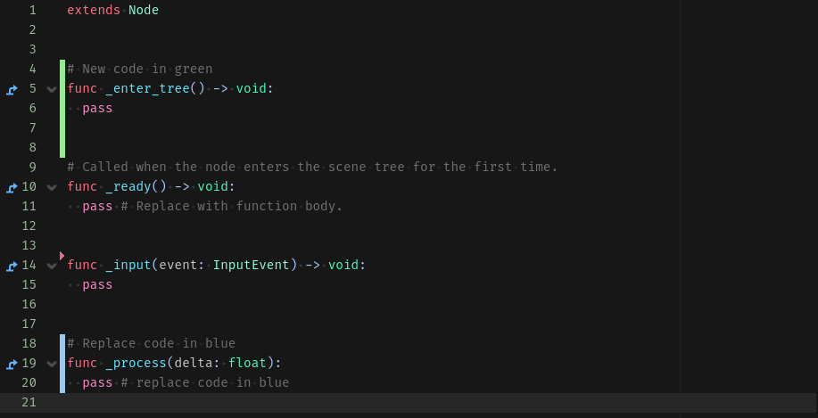

# Diff margin

Diff Margin is a Godot plugin. Please see official website for [instructions to install](https://docs.godotengine.org/en/stable/tutorials/plugins/editor/installing_plugins.html).

Diff Margin displays Git changes of the currently edited file on Godot script editor margin.

Customization:
- Git binary path
- Gutter width
- Gutter colors

Tested on Godot 4.3 Windows only.

